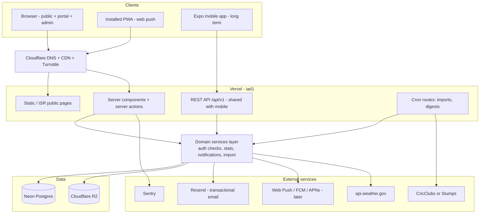
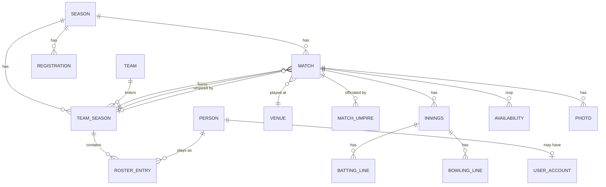

# Cricket League Portal — Architecture Proposal

Status: draft v4 (2026-08-21) · Supersedes v3 · Pending answers to [Open questions](#15-open-questions)

---

## 1. Decisions locked in

| Question | Answer | Consequence |
|---|---|---|
| WhatsApp | **Dropped entirely** | Email is the only notification channel through Phase 3. Push arrives with the mobile app, not before |
| Scoring platform | **CricClubs or Stumps** (not yet chosen) | Import design must stay source-agnostic; a spike is needed before Phase 2 (§8) |
| Location | **Metro Atlanta, US** | `America/New_York` with DST, US privacy law (not GDPR), NWS weather API, `iad1`/us-east hosting |
| Budget | **As close to free as possible** | $0–8/month Phase 1; every paid line item is called out with its free alternative (§12) |
| Team | **5–6 people, Claude-assisted, no stack preference** | Pick the most conventional, best-documented stack; invest heavily in guardrails (§4, §11) |
| Registration window | **Opens ~Aug 31 2026, closes ~Sep 30 2026** | Phase 1 splits into 1a (public + form, ~2 weeks) and 1b (portal, all of September) (§10) |

### 1.1 Round two — confirmed by the committee (2026-08-21)

| Question | Answer | Consequence |
|---|---|---|
| League / season | **CIL Winter League, 2026–2027**, format **T15**, season starts **Oct 24 2026** | Landing page copy finalised; format drives scorecard/overs modelling |
| Domain | **Not owned yet**, target: **this week** | Still the #1 blocker — nothing in email setup can be tested until it lands |
| Branding | Logo exists, will be shared; colours/typeface TBD | Visual design waits on the logo |
| Registration fields | Team name, captain first/last name, email, mobile | Simpler than the placeholder default — no squad list, no rules checkbox |
| Fee | **$650 standard / $800 "with Sponsorship"** — exact meaning still unclear | Form ships **without** a fee-tier selector until confirmed; admins track amount owed manually |
| Payment flow | Off-site. Captain emails a payment screenshot to `CILcommittee@gmail.com`; confirmation email fires **on submission**, not on approval | Matches existing design — this is a receipt/reminder, separate from the later post-close approval + invite email |
| Admins | **5**, all with access to the shared inbox | Seed 5 admin accounts; inbox stays on existing Gmail for now, not a new domain mailbox |
| Sponsors | None confirmed yet | No change to design; sponsor section ships empty with a placeholder |
| Competition format | **2 pools** (A/B, count depends on registrations), **one competition per season**. Max 10 league-stage matches per team; top 6 per pool (12 total) advance to playoffs | `team_seasons.pool` field; standings kept per pool |
| Points table | **Win = 2, tie = 1 each, no result = 1 each**, plus net run rate to 4 decimal places | `team_season_stats.net_run_rate` stored at that precision; points awarded per the fixed scale above |
| Standings tie-break | **Fully specified, multi-level**: points → NRR → head-to-head result → most wins among tied teams (3+ way ties) → most wickets taken → random draw | Needs an explicit tie-break algorithm in the standings service, not a plain sort |
| Playoffs | **Fully resolved from the 2026–27 rule book (§1.2)** — top 2/pool direct to QF; 3rd–6th/pool play a pre-quarter-final round; specific cross-pool QF/SF/Final bracket confirmed | No longer blocked — the bracket generator in Phase 2 can be built against a known structure |
| Player–team binding | **One player, one team, per season** — no mid-season moves | Simplifies stats attribution; no transfer workflow needed |
| Free agents | Handled in CricClubs already | No free-agent signup needed on this site |
| Minors | Under-18 (possibly under-13) players are allowed; **a physical field waiver** (adult co-signs, adult present pitchside) is the current process | This is a liability waiver, not online data consent — see the flag in §13 |
| Minors' public profile | **User's call: no age-based restriction** — full name, photo, stats public for everyone | Not yet confirmed with the committee's counsel/insurer; flagged as a pre-Phase-2 gut-check, see §13 |
| Contact visibility | **Captains can see/edit their own team's player emails/phones**; other captains and the public cannot; committee sees everything | Confirms the original design — no rework needed |
| Umpire visibility | Confirmed: visible only to the two teams in that fixture, once logged in | No change |
| Auth | Magic links to start; Google sign-in may be **added later without breaking anything**, since email is the shared identity key | No change to design |
| Multiple roles | Confirmed: one person can be committee + captain simultaneously | No change |
| Cross-season accounts | Confirmed: accounts and profile data persist season to season, backed by a CricClubs import | No change — reinforces the `people`/`users` split in §6 |
| Historic data source | Still unexplored how to export from CricClubs | The Phase 2 import spike (§8) now covers this too |

### 1.2 The 2026–27 rule book (2026-08-21)

The user provided `CIL Winter Championship_2026-27-Rules.docx`. It resolves the playoff bracket completely and adds several operational rules worth building around.

**Playoff bracket, fully specified:**

```
Top 2 per pool → straight to Quarter-Finals (A1, A2, B1, B2)

Pre-Quarter-Finals (seeds 3–6 per pool):
  PQ1: A3 v A6      PQ2: A4 v A5
  PQ3: B3 v B6      PQ4: B4 v B5

Quarter-Finals:
  Q1: A1 v winner PQ4     Q2: A2 v winner PQ3
  Q3: B1 v winner PQ2     Q4: B2 v winner PQ1

Semi-Finals:
  S1: winner Q1 v winner Q4
  S2: winner Q2 v winner Q3

Final: winner S1 v winner S2
```

Playoff eligibility is by league-stage table position regardless of matches actually played. A player needs ≥3 league-stage matches (30% of the team's matches, "played" meaning on the field for ≥8 overs) to be playoff/final-eligible.

**Points and tie-breaks:** win = 2, tie = 1 each, no result = 1 each. When teams are level on points and NRR, the tie-break cascades: head-to-head result → most wins among the tied teams (for 3+ way ties) → most wickets taken → random draw. This is a genuine multi-level algorithm the standings service needs to implement, not a two-column sort.

**New operational rules that affect the build:**

- **Player-misuse penalty is a manual override, not a pure recompute.** If a team is found to have used an ineligible player, the committee can award the opponent the win/points (no NRR change) or deduct 20 runs from the offending team (which *does* change NRR), entirely at committee discretion. Since §6 says stats are "derived, never hand-edited," this needs an explicit exception: an `standings_adjustment` (or similar) row an admin can apply on top of the computed numbers, logged like everything else in `audit_log`.
- **Roster additions have a recurring weekly deadline** (Friday), not a one-time cutoff before the season — new players must be added by Friday to be eligible that weekend. Worth a soft warning on the captain's roster screen rather than a hard gate, unless the committee wants it enforced.
- **Import cadence is now concrete.** Captains are expected to have scores entered in CricClubs "by the following Monday" after a weekend's matches — so the Phase 2 weekly import should run Monday evening/Tuesday morning, not on an arbitrary schedule.
- **Forfeit rule** for CIL-scheduled (not mutually rescheduled) matches: if one team is ready and the other isn't, the ready team gets the win and points with no NRR change, provided they have ≥6 players present with photo evidence. Exception: unavailability from a clashing ACL playoff match.

**A genuine bonus:** the rule book itself — game rules, ground/field categories, umpiring rules, forfeits, rain/reserve-day handling, Super Over rules — is ready-to-use content for the Phase 3 searchable Rules section (§10). The committee doesn't need to write new copy; it just needs formatting and re-exporting the two embedded diagrams as real image files.

**Still not answered by this document:** the $650/$800 fee-tier meaning, and anything about minors/waivers online. Both remain open (§15).

---

## 2. TL;DR

| Decision | Recommendation |
|---|---|
| App | One **Next.js (App Router) + TypeScript** app — public site, member portal and admin console in a single codebase |
| Hosting | **Vercel**, region `iad1` (Virginia). Free Hobby to start — see the licensing note in §12 |
| Database | **Postgres on Neon** (free tier, DB branching) — Supabase if you'd rather bundle auth + storage |
| ORM | **Prisma** — one declarative schema file, the largest documentation corpus, best AI-assist accuracy |
| Auth | **Magic-link / email OTP**, no passwords — Auth.js (free) or Clerk (free ≤10k MAU) |
| File storage | **Cloudflare R2** (zero egress) or Supabase Storage |
| Email (outbound) | **Resend** + React Email templates; AWS SES if volume outgrows the free tier |
| Inbox (inbound) | **Cloudflare Email Routing** — free forwarding of `info@` to all admins' existing mailboxes |
| Domain/DNS/CDN | **Cloudflare Registrar** (at cost, ~$11/yr) + Cloudflare DNS |
| Scheduled jobs | **Vercel Cron** → route handlers |
| Search (Ph. 3) | **Postgres full-text search** — do *not* add Algolia/Typesense at this size |
| Weather (Ph. 3) | **api.weather.gov** (NWS — free, no key, US-only), Open-Meteo as fallback |
| Mobile (long term) | **PWA + Web Push first**, then **Expo (React Native)** against a versioned `/api/v1` |
| Errors/analytics | Sentry (free tier) + Vercel Analytics |

**Run cost: $0–8/month for Phase 1** (domain amortised), **$10–30/month at full Phase 3.**

---

## 3. Reality check on "Phase 1 can be static"

Phase 1 as written is **not** a static site. It includes a registration form with server-side state, an admin approval workflow, tokenised invite emails, two authenticated portals, file uploads, and a notice board with per-team targeting. That is a full-stack application.

**Recommendation:** build the real Next.js app now, with the "coming soon" page as its landing page. The landing page is statically generated either way, so you pay nothing for the flexibility, and Phase 2/3 become feature additions rather than a rewrite.

Given your Aug 31 date, §10 splits Phase 1 so that only the genuinely date-critical parts — landing page and registration form — must ship in the next two weeks.

### Build vs. buy, stated once

CricClubs is itself a league-management platform: if you score there, you already get a public league page with fixtures, standings and scorecards for free. Your site's value is everything CricClubs *doesn't* do well — your own branding and domain, the registration and approval workflow, the umpiring-team rotation, availability RSVPs, the sponsor and photo archive, the notice board, and one continuous home for 2013-onward history that survives you changing scoring platforms again. That's a real set of reasons, and it maps exactly onto your phases. Worth confirming with the committee once, then not revisiting.

---

## 4. Why this stack

The load is trivial — ~15 teams, ~500 players, writes measured in dozens per day. **Nothing here is a scaling problem.** The real constraints are:

1. **Near-zero cost.**
2. **A 5–6 person Claude-assisted team**, which means the stack should be the one with the most training data and the strongest conventions.
3. **Low maintenance** — this must survive people losing interest.
4. **Public pages fast and shareable** — fixtures and scorecards get pasted into group chats.
5. **Multi-season from day one** (2013 backfill is coming).

### Optimising for an AI-assisted team

This is the input that most changes my recommendations, so it's worth being explicit. AI assistance is dramatically more reliable on conventional, heavily-documented, strongly-typed stacks with a single obvious way to do things. Concretely:

- **Next.js App Router + TypeScript + Tailwind + shadcn/ui** is the single best-documented full-stack web combination in existence right now. Claude writes it well.
- **Prisma over Drizzle** — reversing my v1 recommendation. Drizzle is a fine library, but Prisma has one declarative `schema.prisma` that acts as a compact, readable source of truth you can paste into any conversation, plus a far larger corpus. For your team that matters more than Drizzle's ergonomics.
- **Strict TypeScript + Zod at every boundary.** Types are the mechanism by which the compiler catches AI mistakes before review does. This is not optional.
- **Application-layer authorization, not Postgres RLS.** RLS is powerful and subtle; subtle is exactly wrong for this team. An explicit `can(user, action, resource)` function is readable, testable, and reviewable.
- **One repo, no monorepo, no microservices, no custom infrastructure.** Every piece of bespoke architecture is a piece Claude has no priors about and a new person can't onboard into.

### The stack, with alternatives

| Concern | Choice | Why | Alternative |
|---|---|---|---|
| Framework | Next.js App Router | One codebase for public + portal + admin; server components make public pages cheap and cacheable; best-documented option | Remix, SvelteKit, Astro+API |
| Rendering | SSG/ISR public, dynamic portal | Fixtures & scorecards regenerate on import, then serve from CDN | Full SSR (simpler, marginally slower) |
| UI | Tailwind + **shadcn/ui** (Radix) | Accessible by default — keyboard nav, focus management, ARIA. You own the code, no lock-in | MUI, Mantine |
| DB | Postgres | Stats queries are inherently relational; full-text search built in; JSONB for raw import payloads | Nothing else is a serious contender. Avoid document stores here |
| DB host | **Neon** free tier | Real Postgres, generous free tier, DB branching pairs with Vercel preview deploys | Supabase (bundles auth+storage), Vercel Postgres |
| ORM | **Prisma** | See above | Drizzle if the team turns out to prefer SQL-shaped code |
| Auth | Magic link / email OTP | Your invite flow *is* magic links. 500 casual users will not remember passwords, and you have no support desk | Clerk if you want it done in an afternoon; add Google sign-in later if asked |
| Authorization | App-layer `can()` | Explicit, testable, reviewable | Postgres RLS as later defence-in-depth |
| Email out | **Resend** | 3k/mo free, React Email templates live in the repo, good deliverability | AWS SES (~$0.10/1k, cheapest, more setup) once bulk fixture emails start |
| Inbox in | **Cloudflare Email Routing** | Genuinely free; forwards `info@yourleague.com` to all six admins' existing inboxes | Zoho Mail free (5 mailboxes, webmail only); Google Workspace $7/mo/seat |
| Storage | **Cloudflare R2** | Zero egress fees — matters for Phase 3 photo galleries | Supabase Storage; Cloudinary free tier for auto-transforms |
| Jobs | Vercel Cron | Free, built in, sufficient for weekly imports and reminder digests | Inngest if imports become multi-step workflows needing retries |
| Search | Postgres `tsvector` + GIN | 500 players, 15 teams, a few hundred matches | Typesense only if the rules corpus explodes |
| Weather | **api.weather.gov** | Official NWS, free, no key, no rate limit worth worrying about, US-only (fine — you're in Georgia) | Open-Meteo (free, global) as fallback |

---

## 5. System architecture



### The one structural rule that matters

**All business logic lives in a framework-agnostic services layer** (`src/lib/services/*`), never inline in a page or route handler. Server components, server actions, cron routes and the future mobile API all call the same functions.

```
src/
  app/
    (public)/             # landing, fixtures, teams, players, stats, rules, gallery
    (portal)/             # player + captain, auth required
    (admin)/              # committee console
    api/v1/               # REST surface, versioned, for the future mobile app
    api/cron/             # scheduled jobs
  lib/
    db/                   # prisma schema + migrations + seed
    services/             # registrations, teams, rosters, fixtures, umpiring,
                          # stats, notices, availability, import
    auth/                 # session, roles, can()
    notifications/        # channel-agnostic dispatch + adapters
    integrations/         # scoring adapters, weather, storage
    validation/           # zod schemas shared client + server
  components/
  emails/                 # React Email templates
```

This is the difference between "the mobile app is a month of work" and "the mobile app is a rewrite."

---

## 6. Domain model

Everything is scoped to a **season**. This is the single most important modelling decision — retrofitting seasons after go-live is painful, and you have 2013–2025 to backfill.



**Core tables**

- `seasons` — year, name, status (`upcoming|registration_open|active|archived`), `registration_opens_at`, `registration_closes_at`
- `teams` — durable club identity, survives across seasons
- `team_seasons` — team ↔ season, plus season-specific name, logo, captain, `pool` (A/B — count TBC, see §1.1), `fee_status`
- `people` — durable human identity (name, photo, bio, optional `date_of_birth`, `waiver_on_file`). **Decoupled from `users`** so historic 2013 players exist without accounts
- `users` — login identity, linked to at most one `person`
- `user_roles` — `(user_id, role, scope_type, scope_id)`. Not an enum on `users` (§7)
- `roster_entries` — person ↔ team_season, with `role` (`player|captain|vice_captain|manager`) and shirt number
- `registrations` — Phase 1 submissions: team name, captain name/email/phone, status (`submitted|approved|rejected|withdrawn`), reviewer, notes, `fee_status`
- `invites` — hashed token, email, intended role/team_season, expiry, `consumed_at`
- `venues` — name, address, **lat/long** (needed for NWS weather), notes, map link
- `matches` — season, round, `starts_at` (UTC), venue, home/away `team_season_id`, `umpire_team_season_id`, status (`scheduled|completed|cancelled|abandoned`), result summary, `external_ref`
- `match_umpires` — match ↔ person, assigned_by, assigned_at
- `innings`, `batting_lines`, `bowling_lines`, `fall_of_wickets` — the scorecard
- `player_season_stats`, `team_season_stats` (including `net_run_rate`, stored to 4 decimal places), `standings` — **derived**, rebuilt after every import. Standings computed per pool with the tie-break cascade in §1.2
- `standings_adjustments` — **the one deliberate exception to "never hand-edited."** The rule book allows the committee to penalize a team for fielding an ineligible player (award the opponent the win, or deduct 20 runs, entirely at committee discretion). Model this as a signed adjustment row (team_season, season, points_delta, runs_delta, reason, applied_by) applied on top of the computed standings — never overwrite the computed base, so re-running an import doesn't silently erase a penalty
- `notices` + `notice_targets` (notice ↔ team_season; empty = all)
- `sponsors` — name, tier, logo, url, seasons active
- `committee_members` — name, role, photo, contact, display order
- `availability` — match ↔ person, `yes|no|maybe`, updated_at
- `albums` / `photos` — season- or match-scoped, storage key, caption, uploader
- `rules` — versioned per season, markdown body, full-text searchable
- `import_runs` + `import_staging` — provenance for every import (§8)
- `notifications` — dispatch log (§9)
- `audit_log` — who changed what, when. Cheap now, invaluable when a captain disputes a roster change

**Modelling notes**

- Keep `people` separate from `users`. Most of your 500 players will never log in, and none of the historic ones will.
- "Captain" is not a global role — it's `roster_entries.role = 'captain'` on a specific `team_season`. Likewise a person is an umpire *for a match*, not permanently.
- Store `matches.starts_at` in UTC and render in `America/New_York`. Atlanta observes DST; a season spanning March and November will otherwise drift by an hour. Never store local wall-clock time.
- Keep the raw third-party payload in `import_staging` as JSONB forever. When your parser has a bug in 2028, replay 2026 without re-fetching.
- `external_ref` on `matches`, `teams`, `people` makes imports idempotent upserts rather than duplicate factories.

---

## 7. Auth and access control

| Role | Scope | Can do |
|---|---|---|
| Public (no login) | — | Read everything public: fixtures, scorecards, stats, notices, rules, photos, sponsors |
| Player | own person + team_season | Edit own profile & photo, set availability (Ph. 3), view team calendar |
| Captain | one team_season | Player rights, plus: manage roster (including their own players' emails/phones — confirmed by committee, §1.1), send/revoke invites, edit team name & logo, assign umpires when their team is officiating, view team availability |
| Admin | one season | Approve registrations, open/close/extend registration, manage fixtures & venues, run imports, post notices, upload photos, manage sponsors & committee |
| Super admin | global | All of the above + create seasons, manage admins, archive seasons |

**Enforcement:** every service function opens with an explicit `can()` check. Never rely on a hidden UI button. Public read paths bypass auth entirely so they stay CDN-cacheable.

**Login:** email magic link only. Add Google sign-in later if players ask.

**Two separate captain-facing emails, not one.** The committee's sample confirmation email fires **immediately on form submission** — it's a receipt confirming the form was received and nudging the captain to pay (screenshot to `CILcommittee@gmail.com`) before a stated deadline. That is distinct from the invite below, which only goes out **after the Sep 30 close and committee approval**. Build both as separate events (`registration.submitted` → payment-reminder email; `registration.approved` → setup invite).

**Invite flow — Phase 1's critical path:**

```
Admin approves registration (after verifying payment screenshot against CILcommittee@gmail.com)
  → invite row created (hashed token, captain email, role=captain, team_season, 7-day expiry)
  → Resend sends "Set up your team" email
  → captain clicks link → token validated & consumed → user created, session issued
  → captain adds players (name + email) → one invite row per player
  → player clicks link → creates profile + photo
```

Tokens are single-use, 32+ random bytes, hashed at rest, expiring. **Expect ~20% of invite emails to land in spam.** Build three things on day one: a resend button for captains and admins, a "copy invite link" button so admins can paste it into whatever group chat the league already uses, and correct SPF/DKIM/DMARC records.

---

## 8. Import pipeline (Phase 2)

**This is the highest-risk part of the project**, and it stays risky until you pick between CricClubs and Stumps and find out what each will actually give you.

### Do this spike before Phase 2 design — not during

Neither platform advertises a documented, supported public API for third-party integrations, so **do not assume one exists.** In week one of Phase 2 (or earlier, in parallel with Phase 1 — it's cheap), answer these three questions for whichever platform you choose:

1. Can a league admin **export** scorecards, fixtures and stats — CSV, Excel, JSON, anything?
2. Is there an **undocumented JSON endpoint** behind their web or mobile app serving your league's public pages? (Open devtools on your own league page and look.)
3. Will they **give you access to your own data** if you ask? Small platforms often say yes to a league that emails support. This is the cheapest possible win and nobody tries it.

Their terms of service govern scraping. Since this is your league's own data, an email asking permission is both more likely to work and less likely to break.

**This spike also informs the platform choice itself.** If one of CricClubs or Stumps exports clean data and the other doesn't, that difference is worth more to you over five years than any scoring-UI preference.

### Design the source as swappable

```
ScoringAdapter (interface)
  ├── CricClubsAdapter / StumpsAdapter    ← whichever the spike proves viable
  ├── CsvUploadAdapter                    ← always build this; it's your guaranteed fallback
  └── ManualEntryAdapter                  ← admin types a scorecard when all else fails
```

Build `CsvUploadAdapter` **first**, regardless of what the spike finds. It's the fallback, it's how the 2013+ backfill happens, and it de-risks the entire phase.

### Pipeline stages

1. **Fetch** → store raw payload in `import_staging` with a run id. Never parse and discard.
2. **Match entities** → resolve third-party team/player IDs via `external_ref`. Unmatched names go to a **review queue** — an admin maps "R. Sharma" to the right person once, and the mapping sticks.
3. **Preview diff** → show what will change before committing. Non-negotiable; silent overwrites of corrected data will destroy trust in the site within one season.
4. **Commit** → idempotent upsert in a transaction, keyed on `external_ref`.
5. **Recompute** → rebuild `player_season_stats`, `team_season_stats`, `standings`.
6. **Revalidate** → purge ISR cache for affected match/team/player pages.
7. **Notify** → optional "results are up" notice.

Every stage logs to `import_runs`, so a failure is diagnosable a week later. Make the whole thing re-runnable — you will re-run it.

**Cadence, now concrete (§1.2):** the rule book expects captains to have scores finalised in CricClubs by the Monday following a weekend's matches. Schedule the weekly import for Monday evening or Tuesday morning, not an arbitrary day.

**Backfill (Phase 3):** same pipeline, CSV adapter, one season at a time, newest first. Budget real time. The actual work is not the import code — it's normalising names across 13 years of nicknames, initials, spelling variants and players changing teams.

---

## 9. Notifications (email only)

WhatsApp is out of scope. Still route everything through **one dispatch layer** with channel adapters — that's what makes Web Push and the eventual mobile app a small change instead of a refactor.

```
notify({ event: 'fixture.changed', audience: {...}, payload: {...} })
   → resolve recipients (captain, team members, umpires, admins)
   → per recipient: check preferences + dedupe
   → enqueue notifications rows
   → dispatch: EmailAdapter  [ WebPushAdapter | ExpoPushAdapter later ]
   → record delivery status per row
```

**Events to define now**, even though only email is wired up:
`registration.submitted`, `registration.approved`, `registration.rejected`, `invite.sent`, `fixture.published`, `fixture.changed`, `fixture.cancelled`, `umpire_team.assigned`, `umpire.assigned`, `match.result_published`, `notice.posted`, `availability.reminder`.

**Batching is mandatory, for two reasons.** If an admin uploads 60 fixtures at once, 500 players must not receive 60 emails — debounce fixture events into a per-recipient digest sent a few minutes later. And Resend's free tier caps at **100 emails/day**, which a single bulk fixture publish would blow straight through. Digests keep you under it; if Phase 2 volume still exceeds it, move to AWS SES (~$0.10 per thousand — effectively free at your scale, just more setup).

**Deliverability, in priority order:** verify your domain with Resend, publish SPF and DKIM, add a DMARC record at `p=none` and watch reports for a month before tightening. Send from a real subdomain (`mail.yourleague.com`). US **CAN-SPAM** applies to promotional email — transactional and relationship messages like invites and fixture changes are largely exempt, but anything sponsor- or marketing-flavoured needs a physical mailing address and a working unsubscribe link.

---

## 10. Build plan

Your registration date is the only immovable object here, so Phase 1 splits in two.

### Phase 1a — public site + registration form · **must ship by Aug 31**

Scope is deliberately tiny. This is roughly two weeks of work for a small team.

| Window | Work |
|---|---|
| Aug 16–22 | Domain purchased (targeted this week), Cloudflare DNS, Resend domain verified (SPF/DKIM/DMARC), repo + CI + Vercel + Neon wired, Prisma schema for seasons/registrations/users, `CLAUDE.md` and conventions written (§11). Admin inbox stays on the existing `CILcommittee@gmail.com` for now — no new mailbox needed |
| Aug 23–29 | Landing page: CIL Winter League 2026–2027 info (T15, starts Oct 24), fee ($650/$800 — pending tier clarification), tentative dates, sponsors placeholder, contact/committee page. Registration form (team name, captain first/last name, email, mobile) → DB, with Cloudflare Turnstile. Confirmation/payment-reminder email to captain + notification to admin inbox. Minimal admin console: magic-link login for 5 admin accounts, list submissions, export CSV |
| Aug 29–30 | Accessibility pass, mobile QA, load-test the form once, dry-run a submission end to end |
| **Aug 31** | **Registration opens** |

Everything else waits. No auth beyond admin login, no portal, no rosters.

### Phase 1b — approval workflow + portal · **September**, ready by Oct 1

Registration is live and collecting submissions while you build this. It needs to be ready the day the committee finishes reviewing.

Admin: approve/reject with reason, extend/reopen the window (a season status + timestamp, changeable without a deploy), track `fee_status` manually since payments happen offline.
Then: magic-link auth for members → invite issuance and resend → captain portal (team profile, logo upload, roster CRUD, invite players) → player portal (profile, photo) → notice board with per-team targeting → PWA manifest.

**Design approve/reject to work at any time**, and simply default the committee's workflow to post-close. Someone will want to approve an obvious team early.

### Phase 2 — fixtures, umpiring, results · Oct–Nov

Venues (with lat/long) → fixtures CRUD + bulk CSV upload → umpiring team assignment → captain's umpire-selection screen → notification events wired up → scoring adapter + import review UI → match/team/player pages → standings.

Run the scoring-platform spike (§8) *before* this phase starts, not inside it.

### Phase 3 — archive, search, availability, calendar

Photo albums → historic backfill → rules (versioned markdown, full-text searchable) → universal search → availability RSVPs → calendar views per role → weather on fixtures.

Add an **ICS calendar feed** per team and per player. It's nearly free to build, and it puts fixtures directly into everyone's phone calendar — which quietly removes most of the demand for a mobile app.

### Long term — mobile

Ship the **PWA with Web Push first**: days of work, installable on Android and iOS 16.4+, push works, reuses the site you already have. Build the Expo app only when there's evidence people want a store presence — by then it consumes `/api/v1`, which you've been building since Phase 1.

---

## 11. Working conventions for a Claude-assisted team

Five or six people with AI assistance and no shared stack background will produce a codebase that drifts in five or six directions unless the guardrails are mechanical. Set these up in week one — they cost a day and save the project.

**`CLAUDE.md` at the repo root**, covering: the services-layer rule from §5, "authorization checks go in the service, never the component", "all input validated with Zod at the boundary", the naming conventions, how to add a migration, how to add a notification event, and a pointer to this document. Every contributor's Claude session reads it automatically.

**Mechanical enforcement, because conventions nobody enforces don't exist:**

- `strict: true` in TypeScript. No `any`, enforced by lint.
- ESLint + Prettier + `eslint-plugin-jsx-a11y`, run in CI, blocking merge.
- Zod schemas in `lib/validation/`, shared between client and server. Never trust a form.
- Prisma migrations committed to git; nobody edits the production DB by hand, ever.
- A seed script producing a realistic league — 12 teams, 200 players, a season of fixtures. Everyone develops against the same data.
- Playwright smoke tests on the paths that must never break: submit a registration, approve it, consume an invite, add a player to a roster.
- Branch protection: no direct pushes to `main`, one human review per PR. **AI-generated code needs review more than hand-written code, not less** — it's confident, plausible, and occasionally wrong in ways that read fine.
- Vercel preview deploy + Neon branch per PR, so reviewers click rather than imagine.

**Split work by vertical slice, not by layer.** "Build the registration form end to end" is a good ticket for one person; "build all the API routes" is a merge conflict with a due date.

---

## 12. Cost

| Item | Phase 1 | Full Phase 3 | Free alternative |
|---|---|---|---|
| Domain `.com` | ~$11/yr | ~$11/yr | None — this is the one unavoidable cost |
| Cloudflare DNS + CDN + Turnstile | $0 | $0 | — |
| Cloudflare Email Routing (`info@`) | $0 | $0 | — |
| Vercel | $0 (Hobby) | $0–20/mo | See note below |
| Neon Postgres | $0 | $0–19/mo | Free tier is very likely enough forever at your size |
| Cloudflare R2 | $0 | ~$0–3/mo | 10 GB free; galleries may exceed it by Phase 3 |
| Resend | $0 (3k/mo, 100/day) | $0–20/mo | AWS SES ≈ $0.10/1k — effectively free, more setup |
| Sentry | $0 | $0 | — |
| Weather (NWS) | — | $0 | — |
| **Total** | **≈ $1/mo** | **≈ $0–30/mo** | |

**One licensing caveat you should decide on deliberately:** Vercel's Hobby plan is for personal, non-commercial use. A league site that collects registration fees and displays sponsor logos is arguably commercial. Three honest options:

1. **Vercel Pro, $20/mo.** Removes the ambiguity entirely. For a league with 10–15 teams paying fees, $240/yr is a rounding error — and it's my recommendation if the committee has any budget at all.
2. **Cloudflare Workers/Pages free tier**, which explicitly permits commercial use and is genuinely generous. Next.js runs there via `@opennextjs/cloudflare`, but the path is less trodden than Vercel's — meaning more friction for a Claude-assisted team.
3. **Start on Hobby**, keep the app portable (nothing in §5 is Vercel-specific except the cron routes), and move if it ever becomes an issue.

**A truly free inbox:** Cloudflare Email Routing forwards `info@yourleague.com` to all six admins' existing personal inboxes at no cost. Its one limitation is that it's receive-only — replying *as* `info@` needs an SMTP sender. For Phase 1, admins replying from their own addresses is fine. If the committee wants a proper shared mailbox later, Zoho Mail's free plan covers 5 mailboxes (webmail only), and Google Workspace is $7/mo for one seat with group aliases.

---

## 13. Non-functional requirements

**Accessibility** — target WCAG 2.1 AA. shadcn/Radix handles keyboard and ARIA behaviour; you still owe semantic headings, labelled form fields with associated errors, visible focus rings, 4.5:1 contrast (watch team-colour badges), and alt text on logos and photos. Put `eslint-plugin-jsx-a11y` and an axe check in CI from the first commit — retrofitting accessibility costs many times more than building it in.

**Responsive** — mobile-first. Most traffic will be phones opening links from group chats. Scorecards are the hard case: wide tables. Use a card layout below `sm`, a horizontally scrollable table above it.

**Performance** — public pages statically generated, revalidated on data change. Images via `next/image` with AVIF/WebP. Target LCP < 2.5s on 4G.

**SEO and sharing** — one page per team, player, match and season, with dynamic OpenGraph images. A match-result card that renders properly when pasted into a group chat is the highest-leverage 200 lines in the project.

**Backups** — Neon provides point-in-time recovery, but also run a monthly `pg_dump` to storage *you personally control*. A season's scorecards are irreplaceable and a free-tier account is not a backup strategy.

**Privacy (US)** — no GDPR, and Georgia has no comprehensive consumer privacy statute, so your obligations are lighter than in v1 of this document. That is a floor, not a target. You're storing names, emails, phone numbers and photos of ~500 people, so: publish a plain privacy policy, state a retention period, offer a deletion path. **Player emails and phone numbers are visible to committee and to the player's own captain only** (confirmed §1.1) — never public. Phase 2's "contact the umpire" feature reveals a number only to logged-in members of the teams in that fixture.

**Minors — flagged, not resolved.** The committee confirmed under-13 players exist and are covered by a physical field waiver (adult co-signs, adult present pitchside) — that addresses liability, not online data. The committee also chose, for now, to show full public profiles (name, photo, stats) for every player regardless of age. That is the user's call as relayed, not a confirmed legal sign-off. Because **COPPA** imposes real requirements on collecting/publishing personal information about under-13s, this is worth a deliberate gut-check with the league's insurer or counsel before Phase 2 player pages go live — the fallback if it turns out to matter is cheap (first name + last initial, no photo, for flagged minors) but needs a `date_of_birth` or `is_minor` field captured at profile creation either way.

**Environments** — production + preview (Vercel per-PR deploys, Neon per-PR branches). Anonymised seed data everywhere but production.

**Observability** — Sentry for errors, Vercel Analytics for traffic, plus an internal admin health page showing last import run, failed notifications and pending registrations. Admins should never have to ask a developer whether something worked.

---

## 14. Risks

| Risk | Impact | Mitigation |
|---|---|---|
| Neither CricClubs nor Stumps exports usable data | Phase 2 core feature blocked | Run the spike early (§8); build CSV + manual entry first; treat any API as a bonus |
| Aug 31 registration date slips | League's season timeline slips | Phase 1a scope is frozen and tiny (§10); everything else moves, this doesn't |
| 13 years of historic data is messier than remembered | Phase 3 slips badly | Timebox it; import newest-first; accept partial history; build the name-mapping queue early |
| Invite emails land in spam | Captains can't onboard, in the one week it matters | SPF/DKIM/DMARC before launch; resend button; copyable raw invite link |
| Codebase drifts across 5–6 AI-assisted contributors | Unmaintainable within a season | §11 guardrails in week one, CI-enforced, plus mandatory human review |
| Bus factor of one | Project dies | Boring stack, managed services, no bespoke infra, a README a stranger can follow, and at least two people holding every credential |
| Phase 3 scope creeps into Phase 1 | Miss the registration window | Hard freeze on Phase 1a. Write down the good ideas; ship them in October |
| Standings tie-break algorithm implemented wrong | Wrong team gets a playoff spot — high-visibility bug | The five-level cascade in §1.2 needs dedicated test cases (points, NRR, head-to-head, most-wins, wickets) before it ever runs on real data |

---

## 15. Open questions

Two rounds of committee answers are folded into §1.1. What's left is short.

### Blocking Phase 1a

1. **The domain.** Targeted for this week (§1.1) — still nothing else can be finalised until it's purchased and DNS/email records are set. Ping as soon as it's bought so email verification can start.
2. **The $650 / $800 "with Sponsorship" fee tiers** — what triggers the higher price? The form ships without a selector until this is confirmed; if a selector turns out to be needed, that's a small addition, not a redesign.
3. **Colours and typeface**, once the logo is shared — needed to finalise the landing page visual design.

### Needed before Phase 2's import spike

4. **How to export data from CricClubs** — the Phase 2 import spike (§8), which now needs to answer this for the *live* season feed as well as the historic backfill. The playoff bracket and points/tie-break rules are now fully resolved (§1.2) and no longer block this.

### Worth a deliberate decision before Phase 2 player pages ship

5. **Minors' public profiles** — see the flag in §13. The current default (full public profile regardless of age) was the user's call, not a confirmed sign-off from the committee's insurer or counsel, and the rule book is silent on this. Cheap to change if it turns out to matter, but worth resolving deliberately rather than by default.

Everything else from the original list — sponsors, competition structure, playoff bracket, points/tie-break rules, player–team binding, free agents, contact visibility, auth, multi-role accounts, cross-season accounts — is resolved in §1.1 and §1.2. The fee-tier meaning ($650 vs $800 "with Sponsorship") remains open — the rule book states the $650 fee but doesn't mention a second tier at all, so this may be new for the 2026–27 season and still needs the committee's answer directly.
